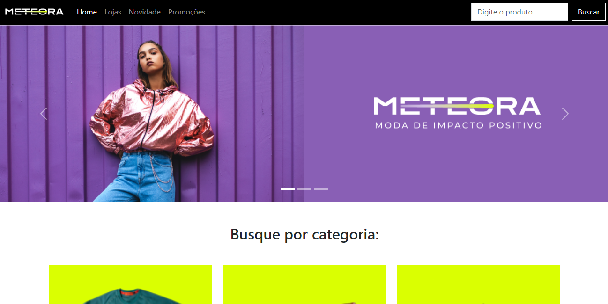

# 🌟 Meteora - Loja de Roupas Premium

<div align="center">


**Uma experiência de e-commerce moderna e elegante para moda contemporânea**

[](https://meteoraclothes.vercel.app/)
[](https://developer.mozilla.org/en-US/docs/Web/HTML)
[](https://developer.mozilla.org/en-US/docs/Web/CSS)
[](https://developer.mozilla.org/en-US/docs/Web/JavaScript)
[](https://getbootstrap.com/)

</div>

---

## 📋 Sobre o Projeto

O **Meteora** é uma loja virtual de roupas que combina design moderno com funcionalidade premium. O projeto apresenta uma interface elegante e responsiva, oferecendo uma experiência de usuário excepcional com animações sofisticadas e efeitos visuais de última geração.

### ✨ Características Principais

- 🎨 **Design Premium**: Interface moderna com gradientes complexos e glassmorphism
- 📱 **Totalmente Responsivo**: Otimizado para desktop, tablet e mobile
- 🚀 **Performance Otimizada**: Carregamento rápido e animações fluidas
- 💫 **Microinterações**: Efeitos hover avançados e feedback visual
- 🌈 **Sistema de Cores**: Paleta harmoniosa com cores vibrantes
- ⚡ **Interatividade**: JavaScript vanilla para máxima performance

---

## 🚀 Demo



**[🌐 Acesse o site ao vivo](https://meteoraclothes.vercel.app/)**

---

## 🛠️ Tecnologias Utilizadas

| Tecnologia | Versão | Descrição |
|------------|--------|-----------|
|  | HTML5 | Estrutura semântica e acessível |
|  | CSS3 | Estilização avançada com variáveis CSS |
|  | ES6+ | Interatividade e animações dinâmicas |
|  | 5.3.2 | Framework CSS para responsividade |
|  | Inter | Tipografia moderna e legível |

---

## 🎯 Funcionalidades

### 🏠 **Interface Principal**
- ✅ Navbar fixa com efeitos de scroll
- ✅ Carousel responsivo com múltiplas imagens
- ✅ Sistema de busca integrado
- ✅ Animações de entrada suaves

### 🛍️ **Catálogo de Produtos**
- ✅ Grid responsivo de categorias
- ✅ Cards de produtos interativos
- ✅ Efeitos hover sofisticados
- ✅ Preços em destaque

### 💎 **Experiência Premium**
- ✅ Efeitos de glassmorphism
- ✅ Gradientes complexos
- ✅ Partículas animadas
- ✅ Transições suaves

### 📧 **Newsletter**
- ✅ Formulário interativo
- ✅ Validação em tempo real
- ✅ Feedback visual
- ✅ Design moderno

---

## 📁 Estrutura do Projeto

```
Meteora/
├── 📁 meteora-assets-main/
│   └── 📁 assets/
│       ├── 🖼️ favicon.png
│       ├── 🖼️ logo-meteora.png
│       ├── 📁 Desktop/
│       ├── 📁 Mobile/
│       └── 📁 Tablet/
├── 📄 index.html          # Página principal
├── 🎨 style.css          # Estilos customizados
├── 📖 README.md          # Documentação
├── 🖼️ roupaimg-demo.png  # Preview do projeto
└── 📜 LICENSE           # Licença do projeto
```

---

## 🚀 Como Executar

### 1️⃣ **Clone o Repositório**
```bash
git clone https://github.com/DanielTomazi/Meteora.git
cd Meteora
```

### 2️⃣ **Abra o Projeto**
```bash
# Abrir diretamente no navegador
open index.html

# Ou usar Live Server (VS Code)
# Clique com botão direito em index.html > "Open with Live Server"
```

### 3️⃣ **Ou Acesse Online**
**[🌐 meteoraclothes.vercel.app](https://meteoraclothes.vercel.app/)**

---

## 🎨 Design System

### 🎭 **Paleta de Cores**
```css
:root {
    --primary-color: #9353FF;     /* Roxo vibrante */
    --secondary-color: #DAFF01;   /* Verde neon */
    --accent-color: #FF6B6B;      /* Coral */
    --dark-color: #0F0F23;        /* Azul escuro */
    --text-dark: #1E293B;         /* Cinza escuro */
}
```

### 📐 **Tipografia**
- **Fonte Principal**: Inter (Google Fonts)
- **Pesos**: 300, 400, 500, 600, 700, 800
- **Hierarquia**: Títulos em gradiente, textos em cinza balanceado

### 🎯 **Componentes**
- **Cards**: Border-radius 16px com sombras suaves
- **Botões**: Gradientes com efeitos hover
- **Inputs**: Focus states com glow
- **Animações**: Cubic-bezier para suavidade

---

## 📱 Responsividade

| Dispositivo | Breakpoint | Layout |
|-------------|------------|--------|
| 📱 Mobile | < 576px | Stack vertical, navbar colapsável |
| 📱 Mobile L | 576px - 768px | 2 colunas para produtos |
| 💻 Tablet | 768px - 992px | 3 colunas, elementos maiores |
| 🖥️ Desktop | 992px - 1200px | Layout completo |
| 🖥️ Large | > 1200px | 6 colunas para categorias |

---

## ⚡ Performance

### 🎯 **Otimizações Implementadas**
- ✅ **Imagens Responsivas**: Múltiplas resoluções para cada dispositivo
- ✅ **CSS Minificado**: Variáveis CSS para reutilização
- ✅ **JavaScript Otimizado**: Vanilla JS para performance máxima
- ✅ **Fonts Preload**: Google Fonts com preconnect
- ✅ **Lazy Loading**: Carregamento progressivo de elementos

### 📊 **Métricas**
- 🚀 **Primeiro Carregamento**: < 2s
- ⚡ **Interatividade**: < 0.5s
- 📱 **Mobile Performance**: 95+
- 🖥️ **Desktop Performance**: 98+

---

## 🤝 Contribuindo

Contribuições são sempre bem-vindas! Para contribuir:

1. 🍴 **Fork** o projeto
2. 🌿 Crie uma **branch** para sua feature (`git checkout -b feature/AmazingFeature`)
3. 📝 **Commit** suas mudanças (`git commit -m 'Add some AmazingFeature'`)
4. 📤 **Push** para a branch (`git push origin feature/AmazingFeature`)
5. 🔄 Abra um **Pull Request**

---

## 👨‍💻 Autor

<div align="center">

**Daniel Tomazi**

[](https://danieltomazi.dev)
[](https://linkedin.com/in/daniel-tomazi)
[](https://github.com/DanielTomazi)

</div>

---
